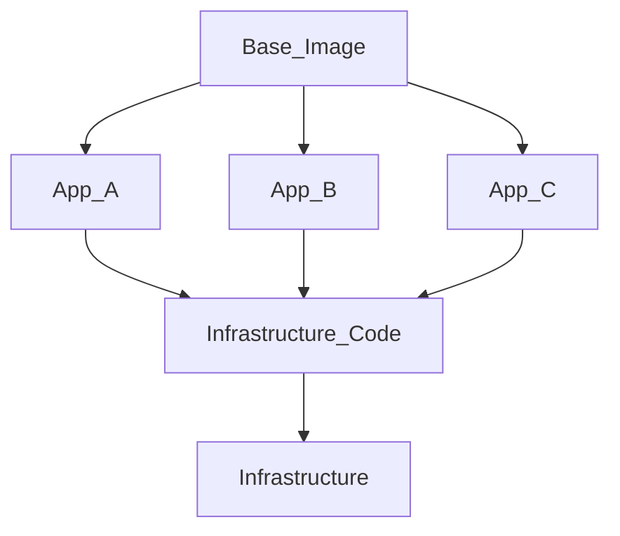

# Makingitallwork Introduction

The makingitallwork (MIAW) repositories are a hobby project to provide an example platform for educational purposes.  This platform will test, build and deploy the sample applications to infrastructure that is managed via infrastructure  as code.  

## 10,000 Foot View
At a very high level this project has 4 main pieces

1.  Base Container
2.  Applications
3.  Infrastructure Code
4.  Infrastructure

Here is a diagram of how all these pieces fit together.  Please not the number of applications is just an example and holds no real significance.

### 1. Base Container 

_Containers are just a CVE delivery system  
-- Unknown_

A base container image (a.k.a golden image) is used to create a standard image for an organization that will contain tools that are standard (expected to be there) throughout an organization.  To learn more about this pattern check out the [doubloon](https://github.com/makingitallwork/doubloon) repo which is the MIAW base container repo. 

### 2. Applications

We probably don't need much of an introduction on this part.  Our applications will be the services we write for this project.  

### 3. Infrastructure code
This will be the code we write to build our infrastructure and deploy our services.  

### 3. Infrastructure
The actual infrastructure that will host our services.  